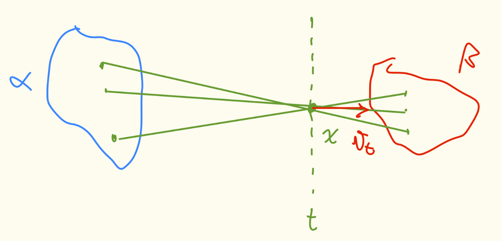

+++
title = "Dynamic Optimal Transport and Flow Matching"
date = 2025-11-05
+++

## Summary
Up to this point we have studied
- Monge and [Kantorovich]() problems.
- Duality of Kantorovich and the Wasserstein metric.
- Slicing OT as a way to lower bound $\W_p$.

Now, we are interested in solving the Kantorovich problem in an alternative way.
The goal here is to find a condition that is sufficient to retrieve a map from $\mathcal{X}$ to $\mathcal{Y}$.
Then, the optimal transport will be given by the objects that minimize a certain criterion over this condition.

More precisely, we will show that
$$
\W_2^2 (\alpha, \beta) = \inf_{(\mu_t, v_t) \in \mathcal{V}(\alpha, \beta)} \int_0^1 \int \| v_t(x) \|^2 \, \mathrm{d} \mu_t \, \mathrm{d} t,
$$
where $\mu_t$ is a path between $\alpha$ and $\beta$, $v_t : [0, 1] \times \mathbb{R}^d \to \mathbb{R}^d$ is a velocity field,
$$
\mathcal{V}(\alpha, \beta) = \{ (\mu_t, v_t) \sim (\text{CE}) \mid \mu_0 = \alpha \; \mu_1 = \beta \},
$$
and (CE) is a PDE known as Continuity Equation.

This will in turn lead to an algorithm (Flow Matching) that creates pushforwards from $\alpha$ to $\beta$ that are not necessarily optimal.
Since in generative models we usually don't care about optimality of the generation transport, this will be very useful.

## Dynamical Formulation

Consider two metrics $\alpha, \beta \in \mathcal{M}_1^+(\mathcal{X})$, where $\alpha$ is absolutely continuous ($\alpha \ll \lambda^d$).
Let $T$ be an optimal map between $\alpha$ and $\beta$, i.e., $T_\# \alpha = \beta$.
We can then define the McCann interpolation between $\mathrm{Id}$ and $T$:
$$
T_t(x) = t T(x) + (1 - t) x.
$$
The associated metric is $\mu_t = (T_t)_\# \alpha$.
In this sense, $\gamma(t) = \mu_t$ is a geodesic between $\alpha$ and $\beta$ in $(\mathcal{P}_2 (\mathbb{R}^d), \W_2)$.


$(\mathcal{X}, d)$ is a geodesic space if for any $x, y \in \mathcal{X}$, there exists a shortest path (geodesic) $\gamma \colon [0, 1] \to \mathcal{X}$ joining them, i.e.,
- $\gamma(0) = x$,
- $\gamma(1) = y$, and
- $d(\gamma(s), \gamma(t)) = |s - t| d(x, y)$ for all $s, t \in [0, 1]$.


We assume that all particles take the same amount of time to reach their destination and each one of them moves with **constant velocity**.
To find this velocity, we can rewrite $T_t$ as follows:
$$
T_t(x) = x + t (\underbrace{T(x) - x}_{\text{velocity}}).
$$

At each step of the McCann Interpolation, we move $x$ to $x_t = T_t(x)$.
One can see $x_0 = T_t^{-1}(x_t)$ as yielding which initial particle $x_0$ was in position $x_t$ at time $t$.
Furthermore, we can say that the velocity of $x_t$ is $T(x_0) - x_0$.


The velocity of a particle in a point $x \in \mathcal{X}$ is given by
$$
v_t(x) = ((T - \mathrm{Id}) \circ T_t^{-1})(x)
$$

An important consequence is that
$$
v_t \circ T_t = T - \mathrm{Id}
$$


Looking the OT problem as a physical one, we can compute the total energy over time of this velocity field $v_t$ as
$$
\begin{aligned}
\int_0^1 \int \| v_t (x) \|^2 \mathrm{d} \mu_t \, \mathrm{d} t &= \int_0^1 \int \| v_t \circ T_t \|^2 \mathrm{d} \alpha \, \mathrm{d} t &&\qquad \because \mu_t = (T_t)_\# \alpha \\
&= \int_0^1 \int \| T(x) - x \|^2 \mathrm{d} \alpha \, \mathrm{d} t \\
&= \int \| T(x) - x \|^2 \mathrm{d} \alpha &&\qquad \because \text{Integral of a constant over $[0, 1]$} \\
&= \W_2^2(\alpha, \beta).
\end{aligned}
$$

Now, we want to show that this pair $(\mu_t, v_t)$ are indeed members of $\mathcal{V}(\alpha, \beta)$.
Later, we will prove that, in fact, this pair is the Infimum discussed in the [summary](#summary).

### Continuity Equation (CE)


The pair $(\mu_t, v_t)$ satisfies (CE) if
$$
\frac{\mathrm{d} \mu_t}{\mathrm{d} t} + \mathrm{div}_x(\mu_t v_t) = 0
$$
in the sense of distribution.
In other words, for all $\psi \in \mathcal{C}_c^\infty (]0, 1[ \times \mathcal{X})$, we have
$$
\int_0^1 \int_\mathcal{X} \frac{\mathrm{d} \psi_t}{\mathrm{d} t} + \langle \nabla_x \psi_t, v_t \rangle \, \mathrm{d} \mu_t \, \mathrm{d} t = 0,
$$
where $\psi_t(x) = \psi(t, x)$.
**Note**: by its definition, $\psi(0, x) = \psi(1, x) = 0$ for all $x \in \mathcal{X}$.



Take $\mu_t = \mathcal{N}(0, \mathrm{Id})$ for $t \in [0, 1]$.
Since $\mu_t$ is constant w.r.t. $t$, we have $\frac{\mathrm{d} \mu_t}{\mathrm{d} t} = 0$.
Moreover, any $v_t$ that performs a rotation centered on $0$ yields no divergence at all.

As such, any rotation centered on $0$ is a solution to (CE).
Note that we have $\infty$ solutions, just for this particular case.


Let's go back to our immediate goal, i.e., prove that $((T_t)_\# \alpha, (T - \mathrm{Id}) \circ T_t^{-1}) = (\mu_t, v_t) \in \mathcal{V}(\alpha, \beta)$.

...


So, $\W_2^2 (\alpha, \beta) = \int_0^1 \int \| v_t (x) \|^2 \, \mathrm{d} \mu_t \, \mathrm{d} t$ and $(\mu_t, v_t) \in \mathcal{V}(\alpha, \beta)$.
Thus,
$$
\W_2^2 (\alpha, \beta) \geq \inf_{(\mu_t, v_t) \in \mathcal{V}(\alpha, \beta)} \int_0^1 \int \| v_t(x) \|^2 \, \mathrm{d} \mu_t \, \mathrm{d} t.
$$

The next step is to prove that $\W_2^2(\alpha, \beta)$ is indeed the Infimum.

### Flow of a vector field


Let $v(t, x)$ be a vector field.
A flow of $v$ is a function $\varphi : [0, 1] \times \mathcal{X} \to \mathcal{X}$ such that

$$
\left\{
\begin{aligned}
&\partial_t \varphi = v(t, \varphi_t(x)) \\
&\varphi_0(x) = x
\end{aligned}
\right.
$$
We assume $\varphi_t(x) = \varphi(t, x)$ is well defined for $t \in [0, 1]$ and it is **unique**.



Let $T$ be an optimal map between $\alpha$ and $\beta$.
Then,
$$
T_t(x) = x + t (T(x) - x) \implies \partial_t T_t (x) = T(x) - x.
$$
Also, $v(t, T_t(x)) = v_t \circ T_t = T(x) - x$.
Thus, $T_t$ is the flow of $v_t$.


Now, we are going to assume we have $v_t$ and its flow $\varphi_t$.
The following theorems provide some insights on the solutions of (CE).


Assume $v_t$ is bounded, Lipschitz in $x$ and uniformly continuous in $t$.
Write $\varphi_t$ be the flow of $v_t$.
Then, $\rho_t = (\varphi_t)_\# \alpha$, $\rho_t \ll \lambda^d$, is the **unique** solution of (CE) such that $\rho_0 = \alpha$.


### Benamou-Brenier


$$
\W_2^2 (\alpha, \beta) = \inf_{(\mu_t, v_t) \in \mathcal{V}(\alpha, \beta)} \int_0^1 \int \| v_t(x) \|^2 \, \mathrm{d} \mu_t \, \mathrm{d} t,
$$
and the solution is the McCann interpolation.



Assume $(\mu_t, v_t) \in \mathcal{V}(\alpha, \beta)$.
Then, using the main theorem, we know that $\mu_t = (\varphi_t)_\# \alpha$, where $\varphi_t$ is the flow of $v_t$.
This implies the following inequality:

$$
\begin{aligned}
    \int_0^1 \int \|v_t(x)\|^2 \, d\mu_t \, dt &= \int_0^1 \int \|v_t \circ \varphi_t\|^2 \, d\alpha \, dt \\
    &= \int \int_0^1 \|v_t \circ \varphi_t\|^2 \, dt \, d\alpha &&\qquad \because \text{Fubini} \\
    &\ge \int \bigg\| \int_0^1 \underbrace{v_t \circ \varphi_t}_{\partial_t \varphi_t} \, dt \bigg\|^2 \, d\alpha &&\qquad \because \text{Jensen} \\
    &= \int \|\varphi_1(x) - \varphi_0(x)\|^2 \, d\alpha \\
    &= \int \| \varphi_1(x) - x \|^2 \, d\alpha \\
    &\geq \W_2^2(\alpha, \beta) &&\qquad \because \varphi_1 \# \alpha = \beta
\end{aligned}
$$


## Flow Matching

### Main idea

Our goal is to find a pushforward between $\alpha$ and $\beta$ that is **not necessarily optimal**.

- First, we find $(\mu_t, v_t) \in \mathcal{V}(\alpha, \beta)$.
- Then, we compute $\varphi_t$, the flow of $v_t$.
- With the flow, we have $\beta = (\varphi_1)_\# \alpha$, so $\varphi_1$ is a pushforward!

The pipeline for generative modeling usually goes like the following:

1. (Easy) Take $\alpha = \mathcal{N}(0, \mathrm{Id})$;
2. (Hard) Compute $v_\theta$ with a Neural Network such that $(v_\theta, \mu_t) \sim (\text{CE})$ with $\mu_t$ a path;
3. (Easy) Integrate $v_\theta$ within the ODE to find $\varphi^{\theta}$ such that $\beta = (\varphi^{\theta})_\# \alpha$;
4. (Easy) Sample $\beta$ by sampling $\alpha$ and applying on $\varphi^{\theta}$.

### Particular $\mu_t$ and $v_t$

We need to choose a path $\mu_t$, but setting it as the McCann interpolation (optimal solution) is too hard.
Our goal is simply to sample from $\beta$, so we don't have to worry too much about the cost of the map.
This is the reason we can allow ourselves to **choose an easy path $\mu_t$**.

We start with some coupling $(X_0, X_1) \sim \pi \in \Pi(\alpha, \beta)$.
This coupling can be as simple as $\pi = \alpha \otimes \beta$ (sample from $\alpha$ and $\beta$ independently).
Then, we can define a very simple linear path
$$
X_t = t X_1 + (1 - t) X_0.
$$
So, our metric path $\mu_t$ is just the law of $X_t$.

The next step is to determine $v_t$.
As we did with $\mu_t$, we can simply **choose an easy $v_t$** that satisfies (CE).
In fact, the following $v_t$ does satisfy the PDE:
$$
v_t(x) = \mathbb{E}_{X_0 \sim \alpha, X_1 \sim \beta}[X_1 - X_0 \mid X_t = x].
$$
Intuitively, what this says is that the velocity at the point $x$, $v_t(x)$, is just the average of the velocities of all particles that are in $x$ at time $t$.
The figure below illustrates the principle.



The problem is that we don't have the density of $\beta$, so we can't compute this expectation directly.
So, we approximate the solution using simple regression:
$$
\mathcal{L}(\theta) = \mathbb{E}\left[\left\| v_\theta(X_t) - \frac{\mathrm{d} X_t}{\mathrm{d} t} \right\|^2\right] = \mathbb{E}[\| v_\theta(X_t) - (\underbrace{X_1 - X_0}_{\text{velocity of $X_t$}}) \|^2].
$$
Thus, I am forcing $v_\theta(X_t)$ to be the velocity of $X_t$.

### Extensions

A major setback of the linear interpolation of $X_t$ is that its law does not have a constant variance.
So, $\mathrm{Var}(X_{t_1})$ may be different than $\mathrm{Var}(X_{t_2})$.


Let $\mathrm{Var}(X_0) = \mathrm{Var}(X_1) = 1$.
Then,
$$
\mathrm{Var}(X_{0.5}) = \mathrm{Var}(0.5 X_0 + 0.5 X_1) = 0.25 \mathrm{Var}(X_0) + 0.25 \mathrm{Var}(X_1) = 0.5.
$$


To solve this issue, one can take another interpolation, like a trigonometric one:
$$
X_t = \cos{\left(\frac{\pi t}{2}\right)} X_0 + \sin{\left(\frac{\pi t}{2}\right)} X_1.
$$
With this, one can verify that the variance is always preserved across $t \in [0, 1]$.
In this particular case, the loss function becomes

$$
\mathcal{L}(\theta) = \mathbb{E}\left[\left\| v_\theta(X_t) - \frac{\mathrm{d} X_t}{\mathrm{d} t} \right\|^2\right] = \mathbb{E}\left[\left\| v_\theta(X_t) - \left(\underbrace{\cos{\left(\frac{\pi t}{2}\right)} X_1 - \sin{\left(\frac{\pi t}{2}\right)} X_0}_{\text{velocity of $X_t$}}\right) \right\|^2\right].
$$

## Exercises

1. Starting from a coupling $(X_0, X_1)$, we define the linear interpolation $X_t = t X_1 + (1 - t) X_0$. We remind that the velocity field defined in flow matching writes
$$
v_t(x) = \mathbb{E}[X_1 - X_0 | X_t = x] = \frac{1}{1-t}\mathbb{E}[X_1 - X_t | X_t = x] = \frac{1}{1-t} (\mathbb{E}[X_1 | X_t = x] - x). 
$$
Let $A \in \mathbb{R}^{d \times d}$ be invertible, $b \in \mathbb{R}^d$ and $c \in \mathbb{R}^*_+$. Show the following properties:

    **(a)** The velocity $v_t^{A,b}$ defined from the coupling $(AX_0 + b, AX_1 + b)$ is given by
    $$
    v_t^{A,b}(x) = Av_t(A^{-1}(x-b)).
    $$

    **(b)** The velocity $v_t^b$ from the coupling $(X_0, X_1 + b)$ is given by $v_t^b(x) = v_t(x - tb) + b$.

    **(c)** The velocity $v_t^c$ defined from the coupling $(X_0, cX_1)$ is given by
    $$
        v_t^c = \frac{c}{1-t+tc} v_r \left( \frac{x}{1-t+tc} \right) + \frac{c-1}{1-t+tc}x, \quad \text{with} \quad r = \frac{tc}{1-t+tc}.
    $$


**(a)** Using the coupling, we have
$$
X_t^{A, b} = t A X_0 + tb + (1 - t) A X_1 + (1 - t)b = A X_t + b.
$$
Let us find the velocity of $X_t^{A, b}$.
$$
v^{A, b}(X_t^{A, b}) = \frac{\d X_t^{A, b}}{\d t} = A \frac{\d X_t}{\d t} = A v_t (X_t).
$$
Using the first equation, we can find $X_t$ in function of $X_t^{A, b}$:
$$
X_t = A^{-1} (X_t^{A, b} - b).
$$
Thus,
$$
v_t^{A, b} (x) = A v_t (A^{-1} (x - b)).
$$

**(b)** Following the same logic as item (a), we have
$$
X_t^b = t (X_1 + b) + (1 - t) X_0 = X_t + tb \implies \frac{\d X_t^b}{\d t} = b + \frac{\d X_t}{\d t}.
$$
We also have that $X_t = X_t^b - tb$.
Thus,
$$
v_t^b (x) = v_t (x - tb) + b.
$$

**(c)** As before, we have $X_t^c = t c X_1 + (1 - t) X_0$.
Let's divide both sides by $1 - t + tc$.
$$
\begin{aligned}
\frac{1}{1 - t + tc} X_t^c &= \underbrace{\frac{tc}{1 - t + tc}}_r X_1 + \frac{1 - t}{1 - t + tc} X_0 \\
&= r X_1 + \frac{1 - t + \overbrace{tc - tc}^{\text{add $0$}}}{1 - t + tc} X_0 \\
&= r X_1 + (1 - r) X_0 = X_r.
\end{aligned}
$$
So, $X_t^c = (1 - t + tc) X_r$.
To find the velocity, we differentiate w.r.t. $t$.
$$
\begin{aligned}
v^c(X_t^c) = \frac{\d X_t^c}{\d t} &= (c - 1) X_r + (1 - t + tc) \frac{\d X_r}{\d t} \\
&= (c - 1) X_r + (1 - t + tc) \frac{\d X_r}{\d r} \frac{\d r}{\d t} \\
&= (c - 1) X_r + (1 - t + tc) \frac{\d X_r}{\d r} \frac{\overbrace{c (1 - t + tc) - (c - 1) tc}^c}{(1 - t + tc)^2} \\
&= (c - 1) X_r + \frac{c}{1 - t + tc} \frac{\d X_r}{\d r}.
\end{aligned}
$$
Thus, we have the desired velocity.
$$
v_t^c(x) = \frac{c - 1}{1 - t + tc} x + \frac{c}{1 - t + tc} v_r \left( \frac{x}{1 - t + tc} \right).
$$


2. Assume that $\alpha$ is an absolutely continuous probability measure with respect to the Lebesgue measure, and $\beta$ is a probability measure on $\mathbb{R}^d$.
Write $T^*$ the optimal transport map between $\alpha$ and $\beta$ for the squared Euclidean cost.
Can we say something on what $T^*$ becomes in the cases considered in Exercise 1?


**(a)** We apply the mapping $\xi \mapsto A \xi + b$ for sampled points from both $\alpha$ and $\beta$.
Since $A$ is invertible, this is a bijection.
Thus, our new transport should be $T_{A, b} (x) = A T^* (A^{-1} (x - b)) + b$.
According to Brenier's theorem, $T_{A, b}$ is optimal if it is the gradient of a convex function $\phi$.
Let's compute the Hessian of $T_{A, b}$ using the chain rule.
$$
\nabla T_{A, b} = A \nabla T^* (A^{-1} (x - b)) A^{-1}.
$$
In general, we can't say that $H \succeq 0 \implies A H A^{-1} \succeq 0$.
So, although $T_{A, b}$ is a valid pushforward, we can't say it is optimal.

**(b)** We are simply adding $b$ to the sampled point from $\beta$, so our new optimal map is $T_b (x) = T^* (x) + b$.
Using Brenier again,
$$
\nabla T_b = \nabla T^*.
$$
Because $T^*$ is optimal, we conclude that $T_b$ also is.

**(c)** Similarly, we are simply multiplying $c$ to the sampled point from $\beta$, so our new optimal transport is $T_c (x) = c T^* (x)$.
$$
\nabla T_c = c \nabla T^*.
$$
Thus, $T_c$ is optimal because $c \in \R_+^*$.



3. Assume that $\alpha$ and $\beta$ are probability measures on $\mathbb{R}$.
Let $(X_0, X_1)$ be a coupling between $\alpha$ and $\beta$ such that the velocity field $v_t(x) = \mathbb{E}[X_1 - X_0 | X_t = x]$ has a unique flow on $[0, 1]$.
Show that the flow $\varphi_t$ associated to $v_t$ is such that $\varphi_1$ is an optimal transport map between $\alpha$ and $\beta$.


We are in 1D, so recall that $\varphi_1$ is OT if, and only if, $x < y \implies \varphi_1(x) < \varphi_1(y)$.
Assume, for the purpose of a contradiction that there are $x < y$ such that $\varphi_1(x) > \varphi_1(y)$.
Then, there must be a time $t$ and a point $z$ such that $z = \varphi_t(x) = \varphi_t(y)$.
This crossing point creates an ambiguity in the flow, making it non-unique.
However, one of the assumptions in the exercise is that the flow is unique.
Thus, there are no crossings and $\varphi_1$ is indeed an optimal transport map.


4. Assume that $(X_0, X_1) \sim \mathcal{N}(0, \Sigma)$ with $\Sigma = \begin{pmatrix} \Sigma_0 & \Sigma_{10} \\ \Sigma_{01} & \Sigma_1 \end{pmatrix}$, for positive definite $\Sigma_0$ and $\Sigma_1$.
Remind that if $(Z, T)$ is a Gaussian vector, then $\mathbb{E}[Z|T] = \mathbb{E}[Z] + \text{Cov}(Z, T)\text{Cov}(T, T)^{-1}(T - \mathbb{E}[T])$.

    **(a)** Show that the velocity field $v_t(x) := \mathbb{E}[X_1 - X_0 | X_t = x]$ is given by
    $$
    v_t(x) = \frac{1}{1-t} \left(((1-t)\Sigma_{01} + t\Sigma_1)\Sigma_t^{-1} - \text{Id}\right) x,
    $$
    where $\Sigma_t = \text{Cov}(X_t) = (1-t)^2\Sigma_0 + (1-t)t(\Sigma_{01} + \Sigma_{10}) + t^2\Sigma_1$.

    **(b)** Let $\Sigma_{01} = \Sigma_{10} = 0$ and assume that $\Sigma_0$ and $\Sigma_1$ can be jointly diagonalized.
    Show that the flow $\varphi_t$ associated to $v_t$ is such that $\varphi_1$ is an optimal transport map between $\alpha$ and $\beta$.


**(a)**
$$
\begin{aligned}
v_t (x) &= \E [X_1 - X_0 \mid X_t = x] \\
&= \underbrace{\E[X_1 - X_0]}_0 + \Cov(X_1 - X_0, X_t) \Cov(X_t, X_t)^{-1} (\underbrace{X_t}_x - \underbrace{\E[X_t]}_0) \\
&= [\Cov(X_1, X_t) - \Cov(X_0, X_t)] \Sigma_t^{-1} x.
\end{aligned}
$$
At this point, note that
$$
\begin{aligned}
\Sigma_t &= \Cov(X_t, X_t) = \Cov(t X_1 + (1-t) X_0, X_t) = t \Cov(X_1, X_t) + (1 - t) \Cov(X_0, X_t) \\
&\implies \Cov(X_0, X_t) = \frac{1}{1 - t} \left(\Sigma_t - t \Cov(X_1, X_t)\right).
\end{aligned}
$$
Substituting that in the original $v_t(x)$ expression, we obtain
$$
\begin{aligned}
v_t (x) &= [\Cov(X_1, X_t) - \Cov(X_0, X_t)] \Sigma_t^{-1} x \\
&= \left[ \Cov(X_1, X_t) - \frac{1}{1 - t}(\Sigma_t - t \Cov(X_1, X_t)) \right] \Sigma_t^{-1} x \\
&= \left( \frac{1}{1 - t} \Cov(X_1, X_t) \Sigma_t^{-1} - \frac{1}{1 - t}\Sigma_t \Sigma_t^{-1} \right) x \\
&= \frac{1}{1 - t} \left( \Cov(X_1, t X_1 + (1 - t) X_0) \Sigma_t^{-1} - \mathrm{Id} \right) x \\
&= \frac{1}{1 - t} \left( (t \Sigma_1 + (1 - t) \Sigma_{01}) \Sigma_t^{-1} - \mathrm{Id} \right) x.
\end{aligned}
$$

**(b)** If $\Sigma_{01} = \Sigma_{10} = 0$, then $v_t(x) = \frac{1}{1 - t} (t \Sigma_1 \Sigma_t^{-1} - \mathrm{Id}) x$ and $\Sigma_t = t^2 \Sigma_1 + (1 - t)^2 \Sigma_0$.
Because $\Sigma_0$ and $\Sigma_1$ can be jointly diagonalized, there exists an orthogonal matrix $P$ such that
$$
\left\{
\begin{aligned}
\Sigma_0 &= P D_0 P^\top \implies D_0 = P^\top \Sigma_0 P \\
\Sigma_1 &= P D_1 P^\top \implies D_1 = P^\top \Sigma_1 P
\end{aligned}
\right.
$$


5. Assume that $(X_0, X_1) \sim \sum_{k=1}^K \pi_k \mathcal{N}(m^k, \Sigma^k)$ with $m^k = \begin{pmatrix} m_0^k \\ m_1^k \end{pmatrix}$ and $\Sigma^k = \begin{pmatrix} \Sigma_0^k & \Sigma_{10}^k \\ \Sigma_{01}^k & \Sigma_1^k \end{pmatrix}$ for positive definite $\Sigma_0^k$ and $\Sigma_1^k$.
Write $v_t^k$ the velocity field (2) for the covariance matrix $\Sigma^k$ and write $w_t^k(x) = v_t^k(x - tm_1^k - (1-t)m_0^k) + m_1^k - m_0^k$.
Show that the velocity field $v_t(x) := \mathbb{E}[X_1 - X_0 | X_t = x]$ is given by
$$
v_t(x) = \sum_{k=1}^K \alpha^k(x)w_t^k(x),
$$
where $\alpha^k(x) = \frac{\pi_k p_t^k(x)}{\sum_{j=1}^K \pi_j p_t^j(x)}$, with $p_t^j$ is the Gaussian density of $\mathcal{N}(m_t^j, \Sigma_t^j)$ with $m_t^j = tm_1^j + (1-t)m_0^j$ and $\Sigma_t^j = t^2\Sigma_1^j + (1-t)^2\Sigma_0^j + t(1-t)(\Sigma_{10}^j + \Sigma_{01}^j)$.
What happens if $X_0$ is a standard centered Gaussian and $X_1$ follows a discrete distribution of $K$ equal Dirac masses?


...

