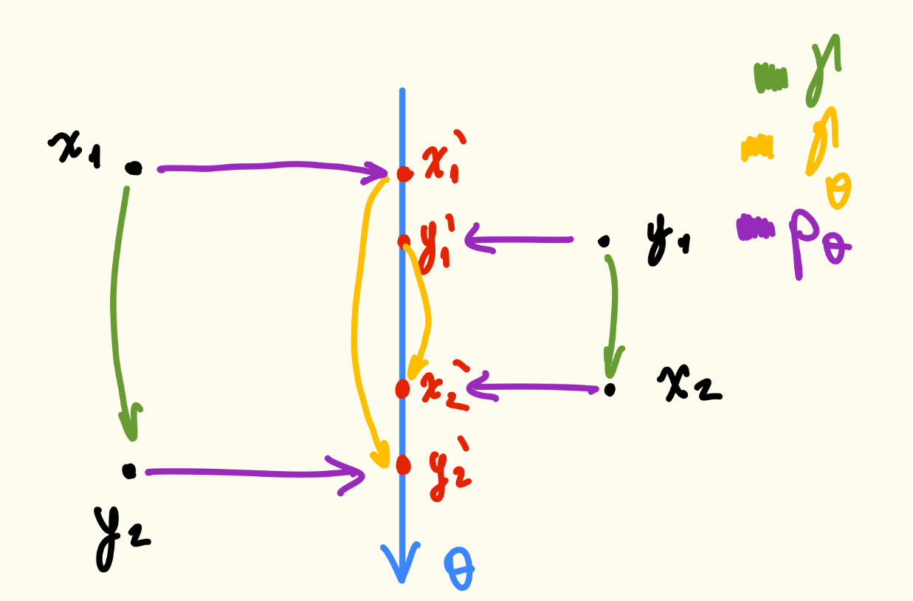

+++
title = "Sliced Optimal Transport"
date = 2025-10-29
+++

## The Slicing Operator

To tackle the computational complexity of the optimal transport problem in high dimensions, we introduce the concept of "slicing" distributions onto 1D lines.


Let $u \in \mathbb{R}^d$. The **slicing operator** $p_u$ is defined as:
$$
p_u(x) = \langle x, u \rangle
$$
If $\mu = \frac{1}{n} \sum \delta_{x_i}$ is a discrete measure, its pushforward by the slicing operator is:
$$
p_u \# \mu = \frac{1}{n} \sum \delta_{\langle u, x_i \rangle}
$$
If $X \sim \mu$, then $\langle u, X \rangle \sim p_u \# \mu$.



For any measurable function $g$ on $\mathbb{R}$ such that $g$ is integrable with respect to $p_u \# \mu$:
$$
\mathbb{E}_{S \sim p_u \# \mu} [g(S)] = \mathbb{E}_{X \sim \mu} [g(p_u(X))]
$$

**Geometric Interpretation:** If $\|u\|=1$, then $p_u$ is the **orthogonal projection** of $x$ to the span of $u$, i.e., $\text{span}(u) = \{ \lambda u \mid \lambda \in \mathbb{R} \}$.


## Sliced-Wasserstein Distance Definition

Let $\mu, \nu$ be two distributions on $\mathbb{R}^d$ and let $c: \mathbb{R}^2 \to \mathbb{R}^+$ be the cost function.


The Sliced-Wasserstein distance is defined as the expectation of the transport cost between the 1D projections of the distributions, taken over all directions on the unit sphere:
$$
SW_c(\mu, \nu) = \mathbb{E}_{\theta \sim \mathcal{U}_{\mathbb{S}^{d-1}}} \left[ W_c(p_\theta \# \mu, p_\theta \# \nu) \right]
$$
where:
* $\mathbb{S}^{d-1} = \{ \theta \in \mathbb{R}^d \mid \|\theta\|_2 = 1 \}$ is the unit sphere in $\mathbb{R}^d$.
* $\mathcal{U}_{\mathbb{S}^{d-1}}$ is the uniform distribution on $\mathbb{S}^{d-1}$.



On $\mathcal{U}_{\mathbb{S}^{d-1}}$, there is a unique measure (Borel) $\sigma$ on $\mathbb{S}^{d-1}$ such that for any non-negative function $f$:
$$
\int_{\mathbb{R}^d} f(x) \, dx = \int_0^\infty \int_{\mathbb{S}^{d-1}} f(r, \theta) \, d\sigma(\theta) \, dr
$$
For any Borel set $B \subseteq \mathbb{S}^{d-1}$:
$$
\mathcal{U}_{\mathbb{S}^{d-1}}(B) = \frac{\sigma(B)}{A(\mathbb{S}^{d-1})}
$$
where $A(\mathbb{S}^{d-1}) = \frac{2\pi^{d/2}}{\Gamma(d/2)}$ is the surface area.


**Why sample $\theta$ from $\mathcal{U}_{\mathbb{S}^{d-1}}$ instead of $\mathbb{R}^d$?**
Integrating on $\mathbb{R}^d$ repeats directional information (redundant).


What is the link between $SW_c$ and the expectation over a standard Gaussian?
$$
\tilde{SW}_c(\mu, \nu) = \mathbb{E}_{\theta \sim \mathcal{N}(0, I_d)} [W_c(p_\theta \# \mu, p_\theta \# \nu)]
$$


### SW of Order $p$

For $p \in [1, +\infty)$, taking the cost $c(x,y) = |x-y|^p$:
$$
SW_p(\mu, \nu) = \left( \mathbb{E}_{\theta \sim \mathcal{U}_{\mathbb{S}^{d-1}}} \left[ W_p^p(p_\theta \# \mu, p_\theta \# \nu) \right] \right)^{1/p}
$$

## Theoretical Properties

The Sliced-Wasserstein distance is a valid metric on probability spaces.


$SW_p$ satisfies all metric axioms:

1.  **Symmetry:** $W_p$ is symmetric $\implies SW_p$ is symmetric.
2.  **Triangle Inequality:** From Minkowski inequality:
    $$
    \forall f, g \in L^p, \, \|f+g\|_p \leq \|f\|_p + \|g\|_p \implies \mathbb{E}[|X-Y|^p]^{1/p} \leq \mathbb{E}[|X|^p]^{1/p} + \mathbb{E}[|Y|^p]^{1/p}
    $$
    Since $W_p$ satisfies the $\Delta$-inequality, combined with Minkowski on the expectation over the sphere $\implies SW_p$ satisfies the $\Delta$-inequality.
3.  **Identity of Indiscernibles:** $SW_p(\mu, \nu) = 0 \iff \mu = \nu$.
    *Proof sketch:* Take the Fourier transform of $\mu$.
    $$
    \mathcal{F}_\mu(r\theta) = \int_{\mathbb{R}^d} e^{-2\pi i \langle r\theta, x \rangle} d\mu(x) = \int_{\mathbb{R}} e^{-2\pi i r t} d[p_\theta \# \mu] = \mathcal{F}_{p_\theta \# \mu}(r)
    $$
    If $SW_p(\mu, \nu) = 0$, then $p_\theta \# \mu = p_\theta \# \nu$ for almost all $\theta$.
    $$
    \implies \mathcal{F}_{p_\theta \# \mu}(r) = \mathcal{F}_{p_\theta \# \nu}(r) \implies \mathcal{F}_\mu(r\theta) = \mathcal{F}_\nu(r\theta).
    $$
    Because the Fourier transform $\mathcal{F}$ is injective, $\mathcal{F}_\mu = \mathcal{F}_\nu \implies \mu = \nu$.


### Relationship with Wasserstein Distance

Generally, **$SW_p \neq W_p$**. However, they are related.


For all $(\mu, \nu) \in \mathcal{M}_+^1(\mathbb{R}^d)$:
$$
SW_p(\mu, \nu)^p \leq c_{d,p} W_p(\mu, \nu)^p
$$
where $c_{d,p} \approx \frac{1}{d} \int_{\mathbb{S}^{d-1}} \|\theta\|_1^p \, d\mathcal{U}_{\mathbb{S}^{d-1}}(\theta)$.

**Proof:** Let $\gamma \in \Pi(\mu, \nu)$ be an optimal transport plan. Then $(p_\theta \otimes p_\theta) \# \gamma$ is a transport plan between $p_\theta \# \mu$ and $p_\theta \# \nu$.
$$
\begin{aligned}
W_p^p(p_\theta \# \mu, p_\theta \# \nu) &\leq \int_{\mathbb{R} \times \mathbb{R}} |s-t|^p d[(p_\theta \otimes p_\theta)\#\gamma](s,t) \\
&= \int_{\mathbb{R}^d \times \mathbb{R}^d} |\langle \theta, x-y \rangle|^p d\gamma(x,y)
\end{aligned}
$$
Integrating over the sphere using Fubini's theorem:
$$
\begin{aligned}
SW_p(\mu, \nu)^p &\leq \int_{\mathbb{S}^{d-1}} \int_{\mathbb{R}^d \times \mathbb{R}^d} |\langle \theta, x-y \rangle|^p d\gamma(x,y) \, d\mathcal{U}_{\mathbb{S}^{d-1}}(\theta) \\
&= \int_{\mathbb{R}^d \times \mathbb{R}^d} \int_{\mathbb{S}^{d-1}} |\langle \theta, x-y \rangle|^p d\mathcal{U}_{\mathbb{S}^{d-1}}(\theta) \, d\gamma(x,y) \\
&\leq c_{d,p} \int_{\mathbb{R}^d \times \mathbb{R}^d} \|x-y\|^p d\gamma(x,y) \\
&= c_{d,p} W_p(\mu, \nu)^p
\end{aligned}
$$



As $p \geq 2$, $c_{d,p} \leq \frac{1}{d}$. If $\mu, \nu$ are supported on $B(0, R) \subset \mathbb{R}^d$:
$$
SW_p(\mu, \nu)^p \leq c_{d,p} W_p(\mu, \nu)^p \leq \tilde{c}_{d,p} R^{p - \frac{1}{d+1}} SW_p(\mu, \nu)^{1/d+1}
$$
This highlights that while equivalent topologically, the constants degrade in high dimensions.


## Numerical Algorithm

In practice, we have finite samples $(X_i)_{i=1}^n \stackrel{iid}{\sim} \mu$ and $(Y_i)_{i=1}^n \stackrel{iid}{\sim} \nu$. The exact $SW_p$ is intractable (integral over sphere), so we use a Monte-Carlo approximation.

$$
SW_p(\mu, \nu) \approx \widehat{SW}_p(\mu, \nu) = \frac{1}{K} \sum_{j=1}^K W_p^p(p_{\theta_j} \# \mu_n, p_{\theta_j} \# \nu_n)
$$


\begin{algorithm}
\caption{Monte-Carlo Sliced-Wasserstein}
\begin{algorithmic}
\STATE \textbf{1. Sample Directions:} Sample $(\theta_j)_{j=1}^K \stackrel{iid}{\sim} \mathcal{U}(\mathbb{S}^{d-1})$.
\COMMENT{Use Gaussian trick:}
\STATE Let $x_1, \dots, x_d \sim \mathcal{N}(0, 1)$
\STATE $Z \leftarrow (\sum |x_i|^2)^{1/2}$
\STATE $\tilde{\theta} \leftarrow (\frac{x_1}{Z}, \frac{x_2}{Z}, \dots, \frac{x_d}{Z})$

\STATE \textbf{2. Project:} For each direction $\theta_j$ and data point $X_i, Y_i$:
\STATE Compute $\langle \theta_j, X_i \rangle$ and $\langle \theta_j, Y_i \rangle$

\STATE \textbf{3. Sort and Average:}
\STATE Compute 1D Wasserstein distance (via sorting) for each $j$.
\STATE $\widehat{SW}_p = \text{Average over } j$.
\end{algorithmic}
\end{algorithm}


### Computational Complexity

Standard Wasserstein vs Sliced-Wasserstein:

* **$W_p(\mu, \nu)$:** $\sim O(n^3)$ (using standard solvers like Hungarian algorithm or network simplex, though $n^2 \log n$ approx exists).
* **$\widehat{SW}_p(\mu, \nu)$:** $\sim O(Kn \log n + Kdn)$.
    * $Kdn$: Projection cost.
    * $Kn \log n$: Sorting cost for 1D OT.

For moderate $K$ and $n \gg d$, $\widehat{SW}_p$ is much faster than $W_p$.

## Exam Preparation Questions


**Problem:** Prove that $SW_p(\mu, \nu) = 0$ implies $\mu = \nu$. Why is the Fourier transform necessary for this proof?

**Solution:**
If $SW_p(\mu, \nu) = 0$, then the integral of the non-negative cost over the sphere is 0. This implies that for almost all directions $\theta$, $W_p(p_\theta \# \mu, p_\theta \# \nu) = 0$. Since $W_p$ is a metric on 1D distributions, this means the projected distributions are identical: $p_\theta \# \mu = p_\theta \# \nu$ almost everywhere.
The Fourier transform of a projection $\mathcal{F}_{p_\theta \# \mu}(r)$ corresponds to a slice of the full Fourier transform $\mathcal{F}_\mu(r\theta)$ passing through the origin. Since the slices match for almost all directions, the Fourier transforms coincide on the whole domain $\mathbb{R}^d$. By the injectivity of the Fourier transform, $\mu = \nu$.



**Problem:** You are given two datasets of $n=10,000$ points in $\mathbb{R}^{100}$. You wish to compute a transport distance.
1. Why is computing the exact Wasserstein distance $W_2$ computationally expensive?
2. Estimate the complexity of computing the Sliced-Wasserstein distance with $K=100$ projections. Which step dominates the complexity?

**Solution:**
1. Exact $W_2$ involves solving a linear assignment problem (or linear program) which generally scales cubically $O(n^3)$ (or super-quadratically). For $n=10,000$, this is prohibitive ($10^{12}$ operations).
2. The complexity of $\widehat{SW}$ is $O(Kdn + Kn \log n)$.
   * Projection: $100 \times 100 \times 10,000 = 10^8$ ops.
   * Sorting: $100 \times 10,000 \times \log_2(10,000) \approx 100 \times 10,000 \times 13 \approx 1.3 \times 10^7$ ops.
   Here, the projection term ($Kdn$) dominates because the dimension $d=100$ is significant compared to $\log n$. The total is roughly linear in $n$, making it feasible.



**Problem:** Describe how to generate a random vector uniformly distributed on the unit sphere $\mathbb{S}^{d-1}$ using standard normal random variables. Why can't we simply sample each coordinate uniformly from $[-1, 1]$ and normalize?

**Solution:**
Algorithm:
1. Sample $d$ independent variables $x_1, \dots, x_d \sim \mathcal{N}(0, 1)$.
2. Compute the norm $Z = \sqrt{\sum x_i^2}$.
3. Return vector $\theta = (x_1/Z, \dots, x_d/Z)$.

We cannot use uniform sampling on $[-1, 1]$ (the hypercube) because the "corners" of the hypercube are further from the origin than the centers of the faces. Projecting points from a hypercube onto the sphere results in a distribution that clusters towards the corners of the hypercube, violating uniformity on the sphere. The Gaussian distribution is rotationally invariant, ensuring the direction is uniform.



**Problem:** In the algorithm for $SW_p$, we compute $W_p(p_\theta \# \mu_n, p_\theta \# \nu_n)$. How is this specific calculation performed efficiently?

**Solution:**
Since the projected measures are 1D empirical distributions (sums of Diracs with uniform weights), the optimal transport map is the monotone rearrangement.
1. Sort the projected source points: $u_{(1)} \leq \dots \leq u_{(n)}$.
2. Sort the projected target points: $v_{(1)} \leq \dots \leq v_{(n)}$.
3. The distance is simply the $L_p$ distance between the sorted vectors: $(\sum |u_{(i)} - v_{(i)}|^p)^{1/p}$.
This requires only sorting, taking $O(n \log n)$ time.


## Exercises

1. *(Comparing isotropic centered Gaussians).* Consider $\mu = \mathcal{N}(0, \sigma^2 \mathbf{I}_d)$ and $\nu = \mathcal{N}(0, \tau^2 \mathbf{I}_d)$, with $\sigma \ge 0, \tau \ge 0$.

    **(a)** Compute the Sliced-Wasserstein distance of order 2 between $\mu$ and $\nu$.

    **(b)** Compare the obtained expression with the Wasserstein distance of order 2 between $\mu$ and $\nu$.


**(a)** First, note that $p_\theta$ performs a linear operation (namely, projection).
Recall that Gaussians remain Gaussian under linear transformations.
So, $(p_\theta)_\# \mu \sim \mathcal{N}(\mathbb{E}_{X \sim (p_\theta)_\# \mu}[X], \mathrm{Var}_{X \sim (p_\theta)_\# \mu}(X))$.
Let us compute these parameters.
$$
\begin{aligned}
\E_{X \sim (p_\theta)_\# \mu}[X] &= \mathbb{E}_{X \sim \mu}[p_\theta(X)] \\
&= \mathbb{E}_{X \sim \mu}[\langle \theta, X \rangle] \\
&= \left\langle \theta, \underbrace{\mathbb{E}_{X \sim \mu}[X]}_0 \right\rangle \\
&= 0.
\end{aligned}
$$
$$
\begin{aligned}
\Var_{X \sim (p_\theta)_\# \mu}(X) &= \Var_{X \sim \mu}(p_\theta(X)) \\
&= \Var_{X \sim \mu}(\theta^\top X) \\
&= \theta^\top \Var_{X \sim \mu}(X) \theta \\
&= \theta^\top \sigma^2 \mathbf{I}_d \theta \\
&= \sigma^2 \| \theta \|^2
\end{aligned}
$$
By construction of $\SW_2$, we have $\| \theta \|^2 = 1 \implies \mathrm{Var}_{X \sim (p_\theta)_\# \mu}(X) = \sigma^2$.
Thus, $(p_\theta)_\# \mu \sim \mathcal{N}(0, \sigma^2)$ and, similarly, $(p_\theta)_\# \nu \sim \mathcal{N}(0, \tau^2)$.
Now, recall that the $2$-Wasserstein distance between two 1-D Gaussians is $\W_2^2(\alpha, \beta) = (\mu_\alpha - \mu_\beta)^2 + (\sigma_\alpha - \sigma_\beta)^2$.
In this case,
$$
\W_2^2 ((p_\theta)_\# \mu, (p_\theta)_\# \nu) = (\sigma - \tau)^2.
$$
Now, to compute the Sliced-Wasserstein distance, we take the expectation around $\mathcal{U}_{\mathbb{S}^{d - 1}}$.
$$
\begin{aligned}
\SW_2^2 (\mu, \nu) &= \mathbb{E}_{\theta \sim \mathcal{U}_{\mathbb{S}^{d - 1}}}[\W_2^2((p_\theta)_\# \mu, (p_\theta)_\# \nu)] \\
&= \mathbb{E}_{\theta \sim \mathcal{U}_{\mathbb{S}^{d - 1}}}[\underbrace{(\sigma - \tau)^2}_{\text{Constant w.r.t. $\theta$}}] \\
&= (\sigma - \tau)^2 \implies \SW_2 (\mu, \nu) = | \sigma - \tau |.
\end{aligned}
$$

**(b)** Recall the expression of 2-Wasserstein for centered Gaussians:
$$
\W_2^2 (\alpha, \beta) = \mathrm{Tr}(\Sigma_\alpha) + \mathrm{Tr}(\Sigma_\beta) - 2 \Tr[\left(\Sigma_\alpha^\frac{1}{2} \Sigma_\beta \Sigma_\alpha^\frac{1}{2}\right)^{\frac{1}{2}}].
$$
Substituting the above with the given covariances, we have
$$
\begin{aligned}
\W_2^2 (\mu, \nu) &= d \sigma^2 + d \tau^2 - 2 d \sigma \tau \\
&= d (\sigma - \tau)^2 \implies \W_2 (\mu, \nu) = \sqrt{d} |\sigma - \tau|.
\end{aligned}
$$
Thus, $\SW_2 (\mu, \nu) = \sqrt{d} \, \W_2 (\mu, \nu)$.


2. *(Projected optimal transport plans).* Let $\mu, \nu \in \mathcal{P}_2(\mathbb{R}^d)$ (measures on $\mathbb{R}^d$ with finite second moments). Denote by $\gamma$ an optimal transport plan between $\mu$ and $\nu$. For any $\theta \in \mathbb{S}^{d-1}$, define $\gamma_\theta = (p_\theta \otimes p_\theta)_\# \gamma$.

    **(a)** Show that $\gamma_\theta$ is a transport plan between $(p_\theta)_\# \mu$ and $(p_\theta)_\# \nu$.

    **(b)** Is $\gamma_\theta$ an optimal transport plan between $(p_\theta)_\# \mu$ and $(p_\theta)_\# \nu$?


**(a)** We want to show that $(P_1)_\# \gamma_\theta = (p_\theta)_\# \mu$ and $(P_2)_\# \gamma_\theta = (p_\theta)_\# \nu$.
$$
\begin{aligned}
(P_1)_\# \gamma_\theta &= ((P_1)_\# (p_\theta \otimes p_\theta))_\# \gamma \\
&= (\underbrace{P_1 \circ (p_\theta \otimes p_\theta)}_{(x, y) \mapsto p_\theta(x)})_\# \gamma \\
&= (p_\theta \circ P_1)_\# \gamma \\
&= (p_\theta)_\# (P_1)_\# \gamma \\
&= (p_\theta)_\# \mu.
\end{aligned}
$$
Similarly, $(P_2)_\# \gamma_\theta = (p_\theta)_\# \nu$.
Thus, $\gamma_\theta$ is a map between $(p_\theta)_\# \mu$ and $(p_\theta)_\# \nu$.

**(b)** No. The following picture shows a counter-example for $d = 2$.

We clearly see that $\gamma_\theta$ is not optimal, even though $\gamma$ is.


3. *(Translation decomposition for $\mathbf{SW}_2$).* Let $\mu, \nu \in \mathcal{P}_2(\mathbb{R}^d)$ (measures on $\mathbb{R}^d$ with finite second moments), and denote by $\mu_0, \nu_0$ the respective *centered* versions.

    **(a)** Prove that for any $\theta \sim \mathcal{U}_{\mathbb{S}^{d-1}}$, $\mathbb{E}_{s \sim (p_\theta)_\# \mu}[s] = \langle \theta, \mathbb{E}_{x \sim \mu}[x] \rangle$ and $\mathbb{E}_{t \sim (p_\theta)_\# \nu}[t] = \langle \theta, \mathbb{E}_{y \sim \nu}[y] \rangle$.

    **(b)** Prove that $((p_\theta)_\# \mu)_0 = (p_\theta)_\# \mu_0$ and $((p_\theta)_\# \nu)_0 = (p_\theta)_\# \nu_0$, with $\mu_0 = (T_{-u})_\# \mu$ and $\nu_0 = (T_{-v})_\# \nu$ for a unique pair $(u, v) \in \mathbb{R}^d \times \mathbb{R}^d$ (whose values must be precised).

    **(c)** Show that $\mathbf{SW}_2(\mu, \nu)$ admits the following decomposition,
    $$
    \mathbf{SW}_2(\mu, \nu)^2 = \frac{1}{d} \|u - v\|^2 + \mathbf{SW}_2(\mu_0, \nu_0)^2
    $$
    *(Hint: $\mathbb{E}_{\theta \sim \mathcal{U}_{\mathbb{S}^{d-1}}} [\theta \theta^T] = (1/d) \mathbf{I}_d$.)*


**(a)** Let $f$ be a measurable function and $T$ be a transport map.
$$
\begin{aligned}
\E_{s \sim T_\# \mu}[f(s)] &= \int f(s) \, \mathrm{d} T_\# \mu (s) \\
&= \int f(T(x)) \, \mathrm{d} \mu \qquad \because \text{Definition of pushforward} \\
&= \E_{x \sim \mu}[f(T(x))].
\end{aligned}
$$
Now, if we let $f(s) = s$ and $T = p_\theta$, it is clear that
$$
\begin{aligned}
\E_{s \sim (p_\theta)_\# \mu}[s] &= \E_{x \sim \mu}[p_\theta(x)] \\
&= \E_{x \sim \mu}[\theta^\top x] = \theta^\top \E_{x \sim \mu}[x] = \langle \theta, \mathbb{E}_{x \sim \mu}[x] \rangle.
\end{aligned}
$$
Similarly, $\mathbb{E}_{t \sim (p_\theta)_\# \nu}[t] = \langle \theta, \mathbb{E}_{y \sim \nu}[y] \rangle$.

**(b)** Let $X \sim \mu$. Then, $S \sim (p_\theta)_\# \mu$ if and only if $S = \langle \theta, X \rangle$.
To have the centered distribution, $S_0 \sim ((p_\theta)_\# \mu)_0$ if $S_0 = S - \E{S} = \langle \theta, X - \E[X] \rangle$, as per item (a).
Coming from the other side, $X_0 \sim \mu_0$ if and only if $X_0 = X - u$.
This means that $S' \sim (p_\theta)_\# \mu_0$ if $S' = \langle \theta, X_0 \rangle = \langle \theta, X - u \rangle$.
Thus, we conclude that $S_0 = S'$ if, and only if, $u = \E_\mu [X]$.
Similarly, $v = \E_\nu [Y]$.

**(c)** Recall that for any $\alpha, \beta$, we have
$$
\W_2^2 (\alpha, \beta) = \| \E_\alpha [X] - \E_\beta [Y] \|^2 + \W_2^2 (\alpha_0, \beta_0).
$$
Using this with $(p_\theta)_\# \mu$ and $(p_\theta)_\# \nu$, we retrieve
$$
\begin{aligned}
\W_2^2 ((p_\theta)_\# \mu, (p_\theta)_\# \nu) &= \| \E_{(p_\theta)_\# \mu}[X] - \E_{(p_\theta)_\# \nu}[Y] \|^2 + \W_2^2 (((p_\theta)_\# \mu)_0, ((p_\theta)_\# \nu)_0) \\
&= \| \langle \theta, \E_\mu [X] \rangle - \langle \theta, \E_\nu [Y] \rangle \|^2 + \W_2^2 ((p_\theta)_\# \mu_0, (p_\theta)_\# \nu_0) \\
&= (u - v)^\top \theta \theta^\top (u - v) + \W_2^2 ((p_\theta)_\# \mu_0, (p_\theta)_\# \nu_0).
\end{aligned}
$$
Then, we apply the definition of $\SW_2^2$.
$$
\begin{aligned}
\SW_2^2 (\mu, \nu) &= \E_{\theta} [\W_2^2 ((p_\theta)_\# \mu, (p_\theta)_\# \nu)] \\
&= \E_{\theta} [(u - v)^\top \theta \theta^\top (u - v) + \W_2^2 ((p_\theta)_\# \mu_0, (p_\theta)_\# \nu_0)] \\
&= (u - v)^\top \E_{\theta} [\theta \theta^\top] (u - v) + \E_{\theta} [\W_2^2 ((p_\theta)_\# \mu_0, (p_\theta)_\# \nu_0)] \\
&= \frac{1}{d} \| u - v \|^2 + \SW_2^2 (\mu_0, \nu_0).
\end{aligned}
$$


