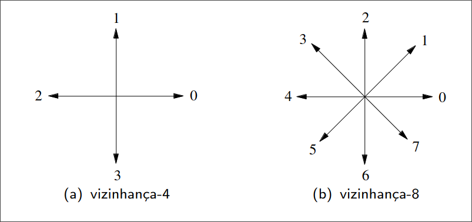

+++
title = 'MC920 - Introdução ao Processamento de Imagem Digital'
date = 2024-06-13
draft = false
+++

## Representação
Queremos encontrar maneiras eficientes de descrever e representar objetos em imagens.
Idealmente, as representações não deveriam ser alteradas por **ruído** e **transformações geométricas**.

Para simplificar os descritores, consideraremos imagens em preto e branco.

### Código da cadeia

O código da cadeia é um esquema que foi feito para representar as *bordas* de um objeto.
Dado um ponto inicial pertencente à borda, o código é definido por uma sequência formada pelas direções entre cada pixel e seu vizinho, até que a borda seja fechada.


A direção de cada segmento pode ser codificada em vizinhança-4 ou vizinhança-8.



## Morfologia Matemática

## Textura

## Transformações Geométricas

## Compressão
